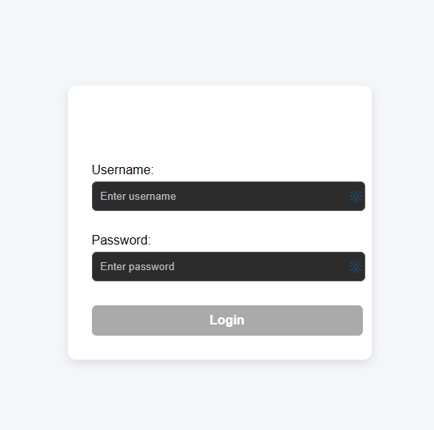
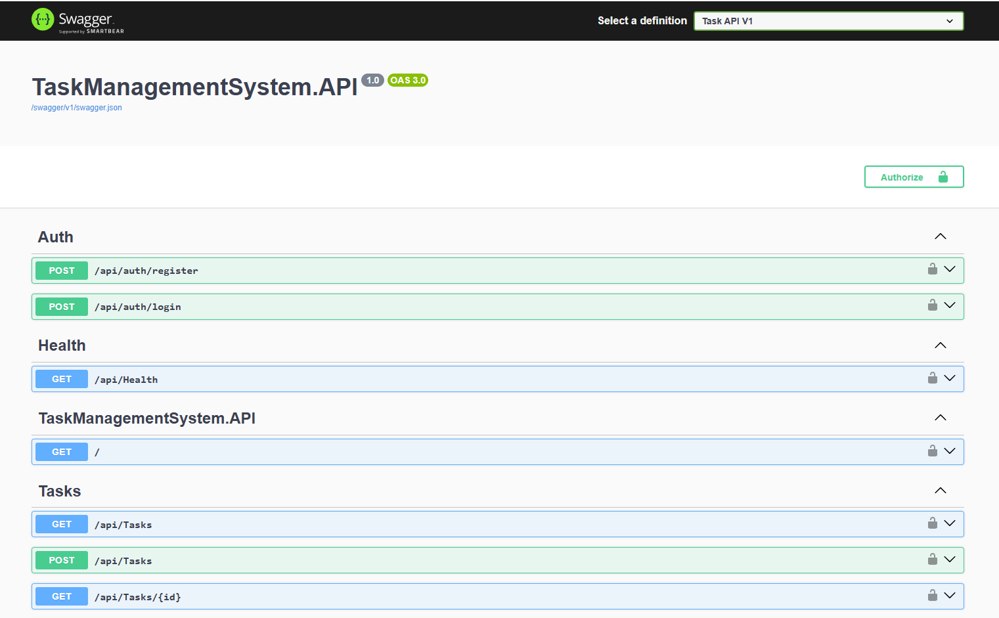

## Task Management Frontend

--- 


A modern Angular frontend application for task management, fully containerized with Docker and deployed on Azure Container Apps.

---

# Live Application

Frontend URL:

https://task-frontend-container.livelywave-91602587.francecentral.azurecontainerapps.io

---

# Features

User login

JWT authentication

Task CRUD complete

Pagination / Filtering / Sorting

Internationalization (English / French)

Responsive UI

API integration

Production Environment Configuration

Dockerized Angular Application

Azure Cloud Deployment

--- 

# Architecture

```text
┌──────────────────────┐
│   Angular Frontend   │
│  Azure Container App │
└──────────┬───────────┘
           │ HTTP API
           ▼
┌──────────────────────┐
│  ASP.NET Core API    │
│ Azure Container App  │
└──────────┬───────────┘
           │
           ▼
┌──────────────────────┐
│      SQL Server      │
│      Azure SQL       │
└──────────────────────┘
```

---

# Screenshots

Login Page



### Dashboard


### Swagger API



---

# Tech Stack

Angular

TypeScript

RxJS

ngx-translate

Angular Router

Docker

Nginx

Azure Container Apps

--- 

# Project Structure

```text
Task Management Frontend
├───app
│   ├───core
│   │   ├───guards
│   │   ├───interceptors
│   │   ├───models
│   │   └───services
│   ├───features
│   │   ├───auth
│   │   │   ├───login
│   │   │   └───register
│   │   └───tasks
│   │       ├───task-create
│   │       ├───task-edit
│   │       ├───task-list
│   │       └───task-update
│   └───shared
│       ├───components
│       │   └───navbar
│       ├───confirm-dialog
│       └───pipes
├───assets
│   └───i18n
├───environments
└───ngx-toastr
```
---

# Running Locally

Clone repository:

git clone https://github.com/ThaiBangHOANG/Task-management-frontend

Install dependencies:

npm install

Run application:

ng serve

Default URL:

http://localhost:4200

---


# Docker

Build image

docker build -t task-frontend .

Run container

docker run -p 4200:80 task-frontend

---

# Deployment

Frontend deployed using:

DockerHub

Azure Container Apps

Github Actions

---

# Author

Thai Bang HOANG
